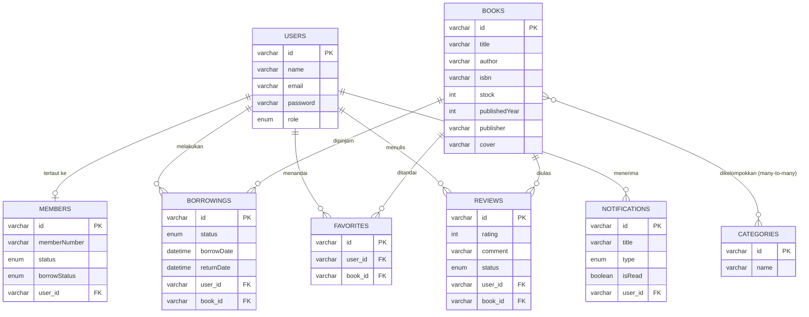

# 📚 AksaraHub — Sistem Informasi Perpustakaan Digital

> **Proyek Ujian Akhir Semester (UAS) — Mata Kuliah Pemrograman Web (ST084)**
> Program Studi S1 Informatika — Fakultas Ilmu Komputer — Universitas AMIKOM Yogyakarta
> Kelompok Virgo — 2026

[](https://nodejs.org/)
[](https://nestjs.com/)
[](https://react.dev/)
[](https://vitejs.dev/)
[](https://typeorm.io/)
[](https://www.mysql.com/)

---

## Daftar Isi

1. [Deskripsi Proyek](#-deskripsi-proyek)
2. [Fitur Utama](#-fitur-utama)
3. [Teknologi yang Digunakan](#-teknologi-yang-digunakan)
4. [Arsitektur Sistem](#-arsitektur-sistem)
5. [Struktur Basis Data](#-struktur-basis-data)
6. [Struktur Direktori Proyek](#-struktur-direktori-proyek)
7. [Persyaratan Sistem](#-persyaratan-sistem)
8. [Panduan Instalasi & Menjalankan Aplikasi](#-panduan-instalasi--menjalankan-aplikasi)
9. [Dokumentasi API (Swagger)](#-dokumentasi-api-swagger)
10. [Daftar Endpoint API](#-daftar-endpoint-api)
11. [Akun Default (Seeder)](#-akun-default-seeder)
12. [Aturan Bisnis Penting](#-aturan-bisnis-penting)
13. [Kelompok Pengembang](#-kelompok-pengembang)

---

## 📝 Deskripsi Proyek

**AksaraHub** adalah sistem informasi perpustakaan digital berbasis web yang menggantikan pencatatan manual (buku besar/spreadsheet) dengan sistem terpusat: katalog buku dengan pencarian & filter kategori, keanggotaan, peminjaman-pengembalian, favorit, ulasan/rating, dan notifikasi — dapat diakses admin maupun anggota secara online.

Aplikasi dibangun dengan arsitektur **decoupled**: **backend** NestJS sebagai RESTful API yang menangani seluruh logika bisnis dan akses basis data, **frontend** React yang mengonsumsi API tersebut lewat Axios.

## ✨ Fitur Utama

- **Autentikasi & Otorisasi** — Register, login, refresh token otomatis, ganti password, edit profil. JWT (access + refresh token) dengan role `admin`/`user`.
- **Manajemen Buku** — CRUD buku (judul, penulis, ISBN, stok, tahun terbit, penerbit, sinopsis, jumlah halaman, cover), **multi-kategori** per buku, pencarian & pagination server-side.
- **Manajemen Kategori** — CRUD kategori (klasifikasi Dewey Decimal + Fiksi/Nonfiksi/Referensi).
- **Manajemen Anggota (Member)** — CRUD data keanggotaan, **otomatis tersinkronisasi dua arah** dengan akun login: register user baru otomatis membuat data member, dan admin menambah member baru otomatis membuatkan akun login (password default).
- **Peminjaman Buku** — Pinjam & kembalikan buku (stok ter-update otomatis), riwayat peminjaman pribadi, rekap seluruh peminjaman untuk admin.
- **Favorit** — Tandai/batalkan buku favorit, tersimpan per akun di database (bukan localStorage).
- **Ulasan & Rating** — Beri rating 1–5 + komentar per buku, **moderasi admin** (pending → approved/rejected) sebelum tampil publik.
- **Notifikasi** — Notifikasi in-app per pengguna, tandai sudah dibaca (satu/semua).
- **Dashboard & Statistik Admin** — Rekap jumlah buku, kategori, penulis, penerbit, distribusi tahun terbit, dan ketersediaan stok — dihitung langsung dari database.
- **Dokumentasi API otomatis** via Swagger UI.
- **Database seeding otomatis** — data awal (admin, kategori, buku) terisi sendiri saat aplikasi pertama kali dijalankan.

## 🛠 Teknologi yang Digunakan

### Backend
| Teknologi | Fungsi |
|---|---|
| **NestJS 11** | Framework backend berbasis Node.js + TypeScript |
| **TypeORM** | ORM ke basis data relasional |
| **MySQL 8** | Sistem manajemen basis data |
| **JWT (access + refresh token)** | Autentikasi, via `@nestjs/jwt` + `passport-jwt` |
| **bcrypt** | Hashing password |
| **class-validator / class-transformer** | Validasi & transformasi DTO |
| **Swagger (OpenAPI)** | Dokumentasi API interaktif |

### Frontend
| Teknologi | Fungsi |
|---|---|
| **React 18** | Library UI |
| **Vite** | Build tool & dev server |
| **Tailwind CSS** | Styling |
| **React Router** | Routing |
| **Axios** | HTTP client (dengan interceptor auto-refresh token) |

## 🏗 Arsitektur Sistem

```
┌──────────────────────┐        HTTP/REST (JSON)        ┌──────────────────────┐
│   Frontend (React)    │  ─────────────────────────────▶│   Backend (NestJS)    │
│   - UI/UX              │                                 │   - REST API /api     │
│   - Context (Auth,     │ ◀─────────────────────────────  │   - Business Logic    │
│     Favorite, Notif)   │        JWT Bearer Token          │   - JWT Auth Guard    │
└──────────────────────┘                                 └───────────┬──────────┘
                                                                        │ TypeORM
                                                                        ▼
                                                            ┌──────────────────────┐
                                                            │     MySQL Database     │
                                                            └──────────────────────┘
```

Backend mengikuti struktur modular NestJS — setiap domain (`auth`, `book`, `category`, `member`, `user`, `favorite`, `review`, `notification`, `borrowing`) punya Controller–Service–Entity–DTO sendiri.

## 🗄 Struktur Basis Data



Relasi `books` ↔ `categories` bersifat **many-to-many** (lewat tabel pivot `book_categories`) — satu buku bisa punya beberapa kategori sekaligus.

## 📁 Struktur Direktori Proyek

```
ProgWebUASManagementPerpus/
├── backend/                      # NestJS REST API
│   ├── src/
│   │   ├── auth/                  # Register, login, refresh token, profil
│   │   ├── book/                  # CRUD buku + pagination/search + multi-kategori
│   │   ├── category/              # CRUD kategori
│   │   ├── user/                  # Kelola akun login (admin only)
│   │   ├── member/                # Kelola keanggotaan (auto-sync ke user)
│   │   ├── favorite/               # Favorit buku per pengguna
│   │   ├── review/                 # Ulasan & moderasi
│   │   ├── notification/           # Notifikasi in-app
│   │   ├── borrowing/              # Pinjam & kembalikan buku
│   │   ├── seeder/                 # Auto-seed data awal saat start
│   │   ├── app.module.ts
│   │   └── main.ts                 # Entry point + ValidationPipe + Swagger
│   ├── .env.example
│   └── package.json
│
├── frontend/                     # React + Vite
│   ├── src/
│   │   ├── components/             # BookCard, modal admin, dsb.
│   │   ├── contexts/                # AuthContext, FavoriteContext, NotificationContext
│   │   ├── pages/                   # Explore, Library, BookDetail, MyBorrowings, dsb.
│   │   │   └── admin/                # Dashboard, Books, Categories, Users, Reviews, Borrowings, Statistics
│   │   ├── services/                 # authApi, bookApi, borrowingApi, dst. + httpClient (axios)
│   │   └── layouts/App.jsx
│   ├── .env.example
│   └── package.json
│
└── README.md
```

## 💻 Persyaratan Sistem

| Perangkat Lunak | Versi Minimum |
|---|---|
| **Node.js** | v18+ |
| **npm** | terpasang bersama Node.js |
| **MySQL** | v8+ |
| **Git** | versi terbaru |

## 🚀 Panduan Instalasi & Menjalankan Aplikasi

### 1. Clone Repository
```bash
git clone https://github.com/adisalafudin-dev/ProgWebUASManagementPerpus.git
cd ProgWebUASManagementPerpus
```

### 2. Backend

```bash
cd backend
npm install
cp .env.example .env
```

Isi `.env`:
```env
DB_HOST=localhost
DB_PORT=3306
DB_USERNAME=root
DB_PASSWORD=
DB_NAME=perpustakaan_digital
JWT_SECRET=ganti-dengan-string-acak-panjang
JWT_EXPIRES_IN=1d
JWT_REFRESH_EXPIRES_IN=7d
PORT=3001
```
> ⚠️ **Set `PORT=3001`** — `.env.example` frontend sudah mengasumsikan backend jalan di port `3001`. Kalau tetap pakai default `3000`, ubah juga `VITE_API_URL` di `.env` frontend supaya keduanya cocok.

Buat database (nama harus sama persis dengan `DB_NAME`):
```sql
CREATE DATABASE perpustakaan_digital;
```

Jalankan server:
```bash
npm run start:dev
```
Backend berjalan di `http://localhost:3001`. **Tidak perlu perintah seed terpisah** — saat aplikasi pertama kali start dan tabel masih kosong, data awal (1 akun admin, 13 kategori, 30 buku) otomatis terisi lewat `SeederService`. Seeder ini idempotent — kalau data sudah ada, dilewati begitu saja di start berikutnya.

### 3. Frontend

Buka terminal baru:
```bash
cd frontend
npm install
cp .env.example .env
```

Isi `.env` (pastikan port-nya sama dengan backend):
```env
VITE_API_URL=http://localhost:3001/api
VITE_API_TIMEOUT=10000
```

Jalankan:
```bash
npm run dev
```
Frontend dapat diakses di `http://localhost:5173`.

## 📑 Dokumentasi API (Swagger)

Setelah backend berjalan, dokumentasi interaktif tersedia di:
```
http://localhost:3001/api/docs
```
Seluruh endpoint dapat dicoba langsung (*try it out*) dari halaman ini, termasuk endpoint yang butuh JWT (klik tombol **Authorize** dan tempel access token).

## 🔗 Daftar Endpoint API

Base URL: `http://localhost:3001/api`

| Modul | Endpoint Utama | Akses |
|---|---|---|
| **Auth** | `POST /auth/register`, `POST /auth/login`, `POST /auth/refresh`, `POST /auth/logout`, `GET/PATCH /auth/me`, `POST /auth/change-password` | Publik / Login |
| **Books** | `GET /books`, `GET /books/search`, `GET /books/:id`, `POST\|PUT\|PATCH\|DELETE /books/:id` | Publik (baca) / Admin (tulis) |
| **Categories** | `GET /categories`, `POST\|PUT\|PATCH\|DELETE /categories/:id` | Login / Admin |
| **Users** | `GET/POST/PUT/PATCH/DELETE /users`, `PATCH /users/:id/role` | Admin |
| **Members** | `GET/POST/PATCH/DELETE /members` | Admin |
| **Favorites** | `GET/POST /favorites`, `GET /favorites/check/:bookId`, `DELETE /favorites/:id` \| `/favorites/book/:bookId` | Login |
| **Reviews** | `GET/POST/PUT/DELETE /reviews`, `GET /books/:bookId/reviews`, `PATCH /reviews/:id/moderate` | Login / Admin (moderate) |
| **Notifications** | `GET /notifications`, `GET /notifications/unread-count`, `PATCH /notifications/:id/read`, `PATCH /notifications/read-all` | Login |
| **Borrowings** | `POST /borrowings`, `PATCH /borrowings/:id/return`, `GET /borrowings/me`, `GET /borrowings` | Login / Admin (lihat semua) |

Detail lengkap request/response tiap endpoint ada di Swagger UI.

## 🔑 Akun Default (Seeder)

| Role | Email | Password |
|---|---|---|
| Admin | `admin@perpustakaan.com` | `admin123` |

> ⚠️ Ganti password ini lewat halaman Profil setelah login pertama kali kalau aplikasi dipakai di luar lingkungan demo/lokal.

## ⚙️ Aturan Bisnis Penting

- **Sinkronisasi User ↔ Member**: register akun baru otomatis membuat data keanggotaan; admin menambah member baru otomatis membuatkan akun login dengan password default `password` (ditampilkan sekali di respons saat pembuatan — segera diinformasikan ke anggota terkait untuk login & ganti password).
- **Moderasi ulasan**: ulasan baru/hasil edit selalu berstatus `pending`, baru tampil publik setelah disetujui admin.
- **Stok buku**: berkurang otomatis saat dipinjam, bertambah otomatis saat dikembalikan; peminjaman ditolak kalau stok habis.
- **Validasi ketat**: setiap request divalidasi (`whitelist` + `forbidNonWhitelisted`) — field yang tidak dikenali DTO akan ditolak (400), bukan diabaikan.

## 👥 Kelompok Pengembang — Kelompok Virgo

| Nama | NIM | Bagian |
|---|---|---|
| Andra Satya Pratama | 24.11.6056 | Halaman Login & Register, Pencarian, Peminjaman Buku |
| Fauzy Virgiocesa Agyas S | 24.11.6066 | Detail Buku (Favorit & Ulasan), Notifikasi, Riwayat Peminjaman |
| Adi Salafudin | 24.11.6093 | Halaman Admin (Dashboard, CRUD, Moderasi, Statistik) |

---

Proyek ini dibuat untuk keperluan akademik — Ujian Akhir Semester mata kuliah Pemrograman Web (ST084), Universitas AMIKOM Yogyakarta, 2026.
